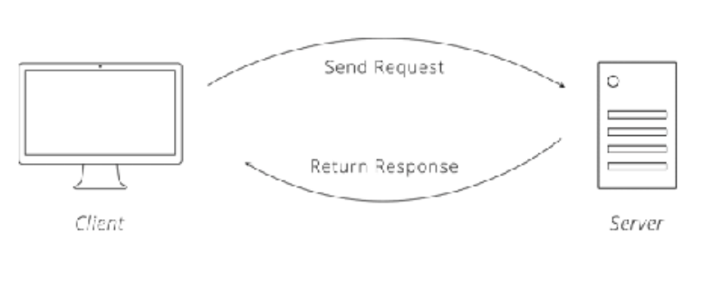

e# api

- sources
    
    1-[https://cdn.zapier.com/storage/learn_ebooks/e06a35cfcf092ec6dd22670383d9fd12.pdf](https://cdn.zapier.com/storage/learn_ebooks/e06a35cfcf092ec6dd22670383d9fd12.pdf)
    
    2-[https://github.com/ellereeeee/notes/blob/master/API and Web Service Introduction/API and Web Service Introduction notes.md](https://github.com/ellereeeee/notes/blob/master/API%20and%20Web%20Service%20Introduction/API%20and%20Web%20Service%20Introduction%20notes.md)
    
- overview api
    
    <aside>
    💡
    
    - what is API
        
        An API is a tool that makes a website's data
        digestible for a computer. Through it, a computer can view and edit
        data, just like a person can by loading pages and submitting forms.
        Making data easier to work with is good because it means people can
        write software to automate tedious and labor-intensive tasks. What
        might take a human hours to accomplish can take a computer seconds
        
    - How An API Is Used
        
        When two systems (websites, desktops, smartphones) link up through
        an API, we say they are "integrated." In an integration, you have two
        sides, each with a special name. One side we have already talked about:
        the server. This is the side that actually provides the API. It helps to
        remember that the API is simply another program running on the
        server 3. It may be part of the same program that handles web traffic,
        or it can be a completely separate one. In either case, it is sitting,
        waiting for others to ask it for data.
        The other side is the "client." This is a separate program that knows
        what data is available through the API and can manipulate it, typically at
        the request of a user. A great example is a smartphone app that syncs
        with a website. When you push the refresh button on your app, it talks to a
        server via an API and fetches the newest info.
        The same principle applies to websites that are integrated. When one
        site pulls in data from the other, the site providing the data is acting as
        the server, and the site fetching the data is the client.
        
    </aside>
    
- HTTP
    
    <aside>
    💡
    
    The Protocol of the Web
    There is a protocol for just about everything; 
    On the web, the main protocol is the Hyper-Text Transfer Protocol,
    better known by its acronym, HTTP. When you type an address like
    [http://example.com](http://example.com/) into a web browser, the "http" tells the browser to
    use the rules of HTTP when talking with the server.
    
    </aside>
    
    - HTTP Requests
        - overview
            
            <aside>
            💡
            
            RequestRes.ponse Cycle. 
            
            
            
            To make a valid request, the client needs to include four things:
            
            - 1 URL (Uniform Resource Locator) 1
                
                
                 In HTTP, a URL is a
                unique address for a thing (a noun). Which things get addressed is
                entirely up to the business running the server. They can make URLs for
                web pages, images, or even videos of cute animals.
                APIs extend this idea a bit further to include nouns like customers,
                products, and tweets. In doing so, URLs become an easy way for the
                client to tell the server which thing it wants to interact with. Of course,
                APIs also do not call them "things", but give them the technical name
                "resources."
                
            - 2 Method
                
                Method
                The request method tells the server what kind of action the client wants
                the server to take. In fact, the method is commonly referred to as the
                request "verb."
                The four methods most commonly seen in APIs are:
                • GET - Asks the server to retrieve a resource
                • POST - Asks the server to create a new resource
                • PUT - Asks the server to edit/update an existing resource
                • DELETE - Asks the server to delete a resource
                
            - 3 List of Headers
                
                Headers provide meta-information about a request. They are a simple
                list of items like the time the client sent the request and the size of the
                request body.
                Have you ever visited a website on your smartphone that was specially
                formatted for mobile devices? That is made possible by an HTTP header
                called "User-Agent." The client uses this header to tell the server what
                type of device you are using, and websites smart enough to detect it
                can send you the best format for your device.
                There are quite a few HTTP headers that clients and servers deal with,
                
            - 4 Body
                
                The request body contains the data the client wants to send the server.
                A unique trait about the body is that the client has complete control
                over this part of the request. Unlike the method, URL, or headers,
                where the HTTP protocol requires a rigid structure, the body allows the
                client to send anything it needs.
                
            </aside>
            
    - HTTP Responses
        
        <aside>
        💡
        
        HTTP responses have a very similar structure to requests. 
        
        The main difference is that instead of a method and a URL, 
        
        the response includes a status code. Beyond
        
        - Status Codes
            
            Status codes are three-digit numbers that each have a unique meaning.
            When used correctly in an API, this little number can communicate a lot
            of info to the client. For example, you may have seen this page during
            your internet wanderings:
            
            
            
        
        The status code behind this response is 404, which means "Not Found."
        There is a slew of other statuses in the HTTP protocol, including 200
        ("Success! That request was good") to 503 ("Our website/API is currently
        down.") 
        The server will not send the
        client any more data until it receives a new request.
        
        
        
        </aside>
        
- Representing Data
    
    <aside>
    💡
    
    principle applies when sharing data between computers. 
    
     this means some kind of text format. The most
    common formats found in modern APIs are JSON (JavaScript Object
    Notation) and XML (Extensible Markup Language).
    
    - JSON
        
        Many new APIs have adopted JSON as a format because it's built on the
        popular Javascript programming language, which is ubiquitous on the
        web and usable on both the front- and back-end of a web app or
        service. JSON is a very simple format that has two pieces: keys and
        values. Keys represent an attribute about the object being described.
        
        
        
        Associative Array.⇒an associative array is just a nested object.
        
    - XML
        
        XML has been around since 1996 1. With age, it has become a very
        mature and powerful data format. Like JSON, XML provides a few
        simple building blocks that API makers use to structure their data. The
        main block is called a node.
        
        
        
    - How Data Formats Are Used In HTTP
        
        how to use them in HTTP. To do so,one of the
        fundamentals of HTTP: headers. we learned that headers
        are a list of information about a request or response. There is a header
        for saying what format the data is in: Content-Type.
        When the client sends the Content-Type header in a request, it is telling
        the server that the data in the body of the request is formatted a
        particular way. If the client wants to send the server JSON data, it will
        set the Content-Type to "application/json." Upon receiving the request
        and seeing that Content-Type, the server will first check if it
        understands that format, and, if so, it will know how to read the data.
        Likewise, when the server sends the client a response, it will also set the
        Content-Type to tell the client how to read the body of the response.
        Sometimes, the client can only speak one data format. If the server
        sends back anything other than that format, the client will fail and
        throw an error. Fortunately, a second HTTP header comes to the
        rescue. The client can set the Accept header to tell the server what data
        formats it is able to accept. If the client can only speak JSON, it can set
        the Accept header to "application/json." The server will then send back
        its response in JSON. If the server doesn't support the format the client
        requests, it can send back an error to the client to let it know the
        request is not going to work.
        With these two headers, Content-Type and Accept, the client and server
        can work with the data formats they understand and need to work
        
        
        
    </aside>
    
- Authentication
    
    <aside>
    💡 site asking you for a username and a password 
    We call these your credentials. 
    Logging-in  is one example of a technical process known as authentication. 
    There are several techniques APIs use to authenticate a client.
    These are called authentication schemes.
    
    - Basic Authentication
        
        the scheme is a perfectly acceptable way for the server to authenticate
        the client in an API.
        Basic Auth only requires a username and password. The client takes
        these two credentials, smooshes them together to form a single value 1,
        and passes that along in the request in an HTTP header called
        Authorization.
        
        
        
         If there is no match, the server
        returns a special status code (401) to let the client know that
        authentication failed and the request is denied.
         the client should have
        different permissions than the account owner. 
        
    - API Key Authentication
        
        API Key authentication is a technique that overcomes the weakness of
        using shared credentials by requiring the API to be accessed with a
        unique key.
         the key is usually a long series of letters and
        numbers that is distinct from the account owner's login password. 
        but now has the option to limit
        administrative functions, like changing passwords or deleting accounts.
        Sometimes, 
        to limit control as well as protect user passwords.
        
    - product key
        
        OAuth. Automating the key exchange is one of the main problems
        OAuth solves. It provides a standard way for the client to get a key from
        the server by walking the user through a simple set of steps. From the
        user's perspective, all OAuth requires is entering credentials. Behind
        the scenes, the client and server are chattering back and forth to get
        the client a valid key.
        There are currently two versions of OAuth, aptly named OAuth 1 and
        OAuth 2. Understanding the steps in each is necessary to be able to
        interact with APIs that use them for authentication. Since they share a
        common workflow, we will walk through the steps of OAuth 2, then
        point out the ways in which OAuth 1 differs.
        
    - OAuth 2
        
         the cast of characters involved in an OAuth exchange:
        • The User - A person who wants to connect two websites they use
        • The Client - The website that will be granted access to 
        • The Server - The website that has the user's data
        Next, we need to give a quick disclaimer. One goal of OAuth 2 is to allow
        businesses to adapt the authentication process to their needs. Due to
        this extendable nature, APIs can have slightly different steps. The
        workflow shown below is a common one found among web-based
        apps. Mobile and desktop applications might use slight variations on
        this process.
        With that, here are the steps of OAuth 2.
        
        - Step 1 - User Tells Client to Connect to Server
            
            The user kicks off the process by letting the client know they want it to
            connect to the server. Usually, this is by clicking a button.
            
            
            
        - Step 2 - Client Directs User to Server
            
            The client sends the user over to the server's website, along with a URL
            that the server will send the user back to once the user authenticates,
            called the callback URL
            
            
            
        - Step 3 - User Logs-in to Server and Grants Client Access
            
            With their normal username and password, the user authenticates with
            the server. The server is now certain that one of its own users is
            requesting that the client be given access to the user's account and
            related data.
            
        - Step 4 - Server Sends User Back to Client, Along with Code
            
            The server sends the user back to the client (to the Callback URL from
            Step 2). Hidden in the response is a unique authorization code for the
            client.
            
        - Step 5 - Client Exchanges Code + Secret Key for Access Token
            
            The client takes the authorization code it receives and makes another
            request to the server. This request includes the client's secret key.
            When the server sees a valid authorization code and a trusted client
            secret key, it is certain that the client is who it claims to be and that it is
            acting on behalf of a real user. The server responds back with an access
            token.
            
            
            
        - Step 6 - Client Fetches Data from Server
            
            At this point, the client is free to access the server on the user's behalf.
            The access token from Step 6 is essentially another password into the
            user's account on the server. The client includes the access token with
            every request so it can authenticate directly with the server.
            
        - 
    - Client Refreshes Token (Optional)
        
        A feature introduced in OAuth 2 is the option to have access tokens
        expire. This is helpful in protecting users' accounts by strengthening
        security - the faster a token expires, the less time a stolen token might
        be used maliciously, similar to how a credit card number expires after a
        certain time. The lifespan of a token is set by the server. APIs in the wild
        use anything from hours to months. Once the lifespan is reached, the
        client must ask the server for a new token.
        
    - How OAuth 1 Is Different
        
        There are several key differences between the versions of OAuth. One
         access tokens do not expire.
        Another distinction is that OAuth 1 includes an extra step. Between
        Steps 1 and 2 above, OAuth 1 requires the client to ask the server for a
        request token. This token acts like the authorization code in Oauth 2
        and is what gets exchanged for the access token.
        A third difference is that OAuth 1 requires requests to be digitally
        signed. We'll skip the details of how signing works (you can find code
        libraries to do this for you), but it is worth knowing why it is in one
        version and not the other. Request signing is a way to protect data from
        being tampered with while it moves between the client and the server.
        Signatures allow the server to verify the authenticity of the requests.
        Today, however, most API traffic happens over a channel that is already
        secure (HTTPS). Recognizing this, OAuth 2 eliminates signatures in an
        effort to make version two easier to use. The trade-off is that OAuth 2
        relies on other measures to provide security to the data in transit.
        
    - Authorization
        
        An element of OAuth 2 that deserves special attention is the concept
        limiting access, known formally as authorization. Back in Step 2, when
        the user clicks the button to allow the client access, buried in the fine
        print are the exact permissions the client is asking for. Those
        permissions, called scope, are another important feature of OAuth 2.
        They provide a way for the client to request limited access to the user's
        data, thereby making it easier for the user to trust the client.
        What makes scope powerful is that it is client-based restrictions. Unlike
        an API Key, where limits placed on the key affect every client equally,
        OAuth scope allows one client to have permission X and another
        permissions X and Y. That means one website might be able to view
        your contacts, while another site can view and edit them.
        
    </aside>
    
- design api
    
    <aside>
    💡
    
    - Architectural Style
        
        SOAP (formerly an acronym ) is an XML-based design that has standardized structures for requests
        and responses. REST, which stands for Representational State Transfer,
        is a more open approach, providing lots of conventions, but leaving
        many decisions to the person designing the API.
        
    - Searching Data
        
        query string
        
        Query means search and string means text. The query
        the string is a bit of text that goes onto the end of a URL to pass things
        along with the API. For example, everything after the question mark is the
        query string in [http://example.com/orders?key=value]
        query parameters.
        
        The client can include multiple query
        parameters by listing one after another, separating them by an
        ampersand ("&"). For example: [http://example.com/orders]
        topping=pepperoni&crust=thin.
        
    - pagination
        
        Another use of the query string is to limit the amount of data returned
        in each request. Often, APIs will split results into sets (say of 100 or 500
        records) and return one set at a time. This process of splitting up the
        data is known as pagination (an analogy to breaking up words into
        pages for books). To allow the client to page through all the data, the
        API will support query parameters that allow the client to specify which
        page of data it wants. In our pizza parlor API, we can support paging by
        allowing the client to specify two parameters: page and size. If the client
        makes a request like GET /orders?page=2&size=200, we know they want
        the second page of results, with 200 results per page, so orders
        201-400.
        
    
    </aside>
    
- communication through APIs
    
    <aside>
    💡
    
    - split integrations
        
         we will split integrations into two broad categories1.
        The first we call "client-driven," where a person interacts with the client
        and wants the server's data to update. The other we call "serverdriven", where a person does something on the server and needs the
        client to be aware of the change.
        
        The reason for dividing integrations in this manner comes down to one
        simple fact: the client is the only one who can initiate communication.
        Remember, the client makes requests and the server just responds. A
        consequence of this limitation is that changes are easy to send from the
        client to the server, but hard to do in the reverse direction.
        
    - Client-Driven Integration
        
         client-driven integrations are easy, let's turn to our
        trusty pizza parlor and its API for ordering pizzas. Say we release a
        smartphone app that uses the API. In this scenario, the pizza parlor API
        is the server and the smartphone app is the client. A customer uses the
        app to choose a pizza and then hits a button to place the order. As soon
        as the button is pressed, the app knows it needs to make a request to
        the pizza parlor API.
        
    </aside>
